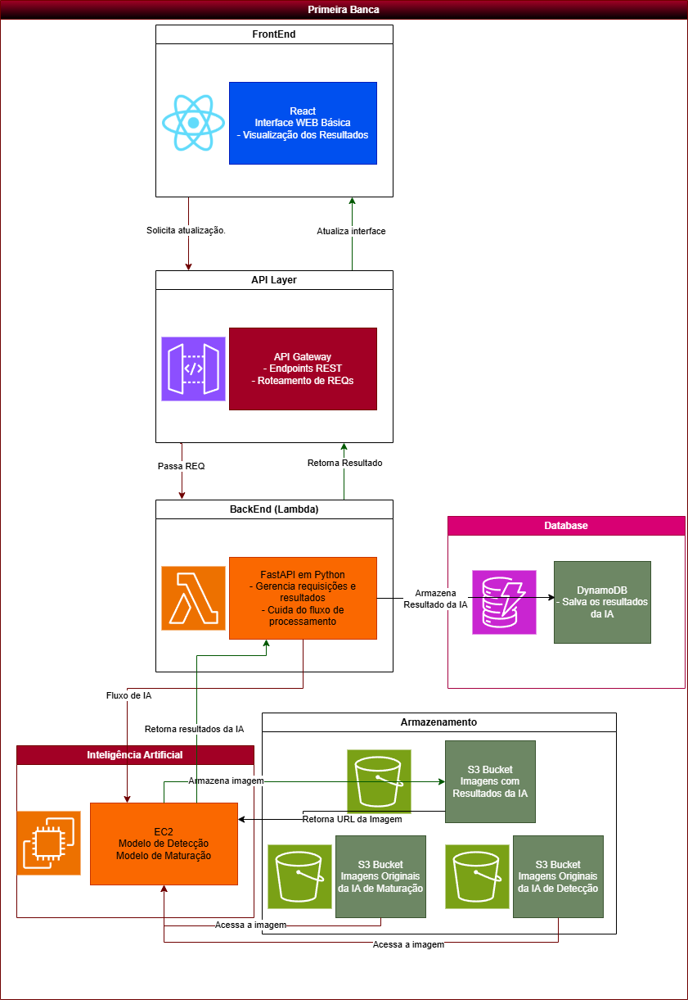

# FastAPI em AWS Lambda: Projeto de IA para Detecção e Maturação de Frutas

Este projeto implementa uma API FastAPI hospedada em AWS Lambda para processamento de frutas usando modelos de Inteligência Artificial. A API permite fazer upload de imagens e processá-las através de modelos de IA hospedados em instâncias EC2.

## INFORMAÇÕES SOBRE O TCC
#### Título: Solução de Visão Computacional para controle de validade em mercados.
#### Faculdade: Instituto Mauá de Tecnologia
#### Curso: Ciência da Computação

##### Alunos:
1. Leonardo Guilmo Chin
2. Luigi Guimarães Trevisan
3. Refael Bidetti Baldi Simões Ferreira
4. Rodrigo Diana Siqueira
5. Vitor Moretti Negresiolo

##### Orientadores:
1. Milkes Yone Alvarenga
2. Sandro Martini
3. Gabriel de Souza Lima

## Arquitetura



O sistema utiliza uma arquitetura serverless na AWS com os seguintes componentes:

1. **Frontend** - Interface React para visualização dos resultados
2. **API Layer** - API Gateway + endpoints REST implementados com FastAPI
3. **Backend (Lambda)** - Lógica de negócios em FastAPI rodando como função Lambda
4. **Armazenamento** - DynamoDB para metadados e S3 para imagens
5. **Inteligência Artificial** - Modelos de IA rodando em EC2

## Funcionalidades

- **Upload de Imagens**: Permite o envio de imagens diretamente para o S3 via URLs pré-assinadas
- **Detecção de Objetos**: Identifica frutas em imagens utilizando modelos de IA
- **Análise de Maturação**: Avalia o estágio de maturação das frutas detectadas
- **Armazenamento de Resultados**: Persistência de imagens e metadados
- **Visualização de Resultados**: Exibe os resultados do processamento com marcações visuais
- **Histórico de Análises**: Mantém um registro das análises anteriores
- **Monitoramento de Dispositivos**: Sistema completo de gerenciamento de dispositivos com camera
- **Consultas Otimizadas**: Busca eficiente de todos os resultados e dispositivos

## Back-End

- **Python 3.9**: Linguagem de programação
- **FastAPI**: Framework para APIs
- **AWS Lambda**: Execução serverless
- **API Gateway**: Roteamento de requisições
- **DynamoDB**: Banco de dados NoSQL para metadados
- **S3**: Armazenamento de objetos para imagens
- **EC2**: Hospedagem de modelos de IA
- **Mangum**: Adaptador para AWS Lambda

## Implantação
- **GitHub Actions**: CI/CD automatizado

## Configuração do DynamoDB - Índices Secundários Globais (GSI)

### ⚠️ IMPORTANTE: Configuração Manual Necessária

Para o funcionamento correto das novas funcionalidades de consulta (buscar todos os resultados e dispositivos), é necessário criar manualmente o seguinte Índice Secundário Global (GSI) nas tabelas do DynamoDB:

### GSI: EntityTypeIndex

Este índice deve ser criado em **APENAS 2 tabelas** do projeto:

1. **Tabela de Resultados** (`DYNAMODB_TABLE_NAME`) ✅
2. **Tabela de Dispositivos** (`DYNAMODB_DEVICES_TABLE`) ✅
3. **Tabela de Atividades** (`DYNAMODB_DEVICE_ACTIVITIES_TABLE`) ❌ **NÃO NECESSÁRIO**

> **Nota**: A tabela de atividades já possui estrutura otimizada (`device_id` + `timestamp`) e não precisa do EntityTypeIndex, pois as consultas são sempre por dispositivo específico.

#### Especificações do GSI:

- **Nome do Índice**: `EntityTypeIndex`
- **Chave de Partição (PK)**: `entity_type` (String)
- **Chave de Ordenação (SK)**: `created_at` (String)
- **Projeção**: `ALL` (todos os atributos)
- **Modo de Capacidade**: Usar o mesmo da tabela principal

#### Instruções para Criação via AWS Console:

1. **Acesse o Console AWS DynamoDB**
2. **Para cada tabela mencionada acima:**
   - Navegue para a aba "Indexes"
   - Clique em "Create index"
   - Configure o índice com as especificações acima:
     ```
     Index name: EntityTypeIndex
     Partition key: entity_type (String)
     Sort key: created_at (String)
     Projected attributes: All
     ```
   - Clique em "Create index"

#### Instruções para Criação via AWS CLI:

```bash
# Para a tabela de resultados
aws dynamodb update-table \
    --table-name seu-nome-tabela-resultados \
    --attribute-definitions \
        AttributeName=entity_type,AttributeType=S \
        AttributeName=created_at,AttributeType=S \
    --global-secondary-index-updates \
        '[{
            "Create": {
                "IndexName": "EntityTypeIndex",
                "KeySchema": [
                    {"AttributeName": "entity_type", "KeyType": "HASH"},
                    {"AttributeName": "created_at", "KeyType": "RANGE"}
                ],
                "Projection": {"ProjectionType": "ALL"},
                "ProvisionedThroughput": {
                    "ReadCapacityUnits": 5,
                    "WriteCapacityUnits": 5
                }
            }
        }]'

# Para a tabela de dispositivos
aws dynamodb update-table \
    --table-name seu-nome-tabela-dispositivos \
    --attribute-definitions \
        AttributeName=entity_type,AttributeType=S \
        AttributeName=created_at,AttributeType=S \
    --global-secondary-index-updates \
        '[{
            "Create": {
                "IndexName": "EntityTypeIndex",
                "KeySchema": [
                    {"AttributeName": "entity_type", "KeyType": "HASH"},
                    {"AttributeName": "created_at", "KeyType": "RANGE"}
                ],
                "Projection": {"ProjectionType": "ALL"},
                "ProvisionedThroughput": {
                    "ReadCapacityUnits": 5,
                    "WriteCapacityUnits": 5
                }
            }
        }]'
```


### Por que este GSI é Necessário?

O `EntityTypeIndex` foi projetado para otimizar as seguintes consultas:

1. **Buscar todos os resultados de inferência** (`GET /storage/results/all`)
   - Consulta por `entity_type = "RESULT"` ou `entity_type = "COMBINED_RESULT"`
   - Ordenação cronológica por `created_at`

2. **Buscar todos os dispositivos** (`GET /devices/all`)
   - Consulta por `entity_type = "DEVICE"`
   - Ordenação cronológica por `created_at`

3. **Análises e relatórios**
   - Agregações por tipo de entidade
   - Consultas temporais eficientes

### Valores dos Campos entity_type:

- **Tabela de Resultados**: `"RESULT"`, `"COMBINED_RESULT"`, `"IMAGE"`
- **Tabela de Dispositivos**: `"DEVICE"`
- **Tabela de Atividades**: ❌ **Não utiliza entity_type** (estrutura própria otimizada)

### Formato do Campo created_at:

- **Formato**: ISO 8601 UTC (ex: `"2024-12-09T15:30:45.123Z"`)
- **Ordenação**: Decrescente (mais recentes primeiro)

### Monitoramento do GSI:

Após a criação, monitore:
- Status do índice (deve ser `ACTIVE`)
- Métricas de consumo de RCU/WCU
- Latência das consultas

## Estrutura do Projeto

```
projeto-fastapi-lambda/
├── .github/workflows/         # Configurações do GitHub Actions
├── src/                       # Código-fonte
│   ├── app/                   # Aplicação principal
│   ├── modules/               # Módulos de funcionalidades
│   │   ├── ia_integration/    # Integração com modelos de IA
│   │   ├── storage/           # Gerenciamento de armazenamento
│   │   └── device_monitoring/ # Monitoramento de dispositivos
│   └── shared/                # Código compartilhado
├── tests/                     # Testes automatizados
├── requirements.txt          # Dependências de produção
└── requirements-dev.txt      # Dependências de desenvolvimento
```

## Novas Funcionalidades

### Consultas Otimizadas

#### Buscar Todos os Resultados de Inferência
```http
GET /storage/results/all?limit=50&last_key=<base64_encoded_key>
```

Retorna todos os resultados de inferência com paginação eficiente usando o GSI EntityTypeIndex.

#### Buscar Todos os Dispositivos
```http
GET /devices/all?limit=50&last_key=<base64_encoded_key>
```

Retorna todos os dispositivos registrados com informações de status e estatísticas.

### Paginação

Ambas as novas rotas implementam paginação robusta:
- **limit**: Número máximo de itens por página (1-200)
- **last_key**: Chave codificada em base64 para continuar na próxima página
- **next_key**: Chave retornada para acessar a próxima página

## Como executar localmente

1. Clone o repositório:
```bash
git clone https://github.com/tcc-2025-maturation-bunches/fastapi-ia-tcc
cd fastapi-ia-tcc
```

2. Crie e ative um ambiente virtual:
```bash
python -m venv venv
source venv/bin/activate  # No Windows: venv\Scripts\activate
```

3. Instale as dependências:
```bash
pip install -r requirements-dev.txt
```

4. **Configure o DynamoDB GSI** seguindo as instruções acima

5. Configure as variáveis de ambiente (copie `.env.template` para `.env`)

## Variáveis de Ambiente

Configure as seguintes variáveis de ambiente:

- `ENVIRONMENT`: Ambiente de execução (dev, hom, prod)
- `AWS_REGION`: Região da AWS
- `DYNAMODB_TABLE_NAME`: Nome da tabela DynamoDB para resultados
- `DYNAMODB_DEVICES_TABLE`: Nome da tabela DynamoDB para dispositivos
- `DYNAMODB_DEVICE_ACTIVITIES_TABLE`: Nome da tabela DynamoDB para atividades
- `EC2_IA_ENDPOINT`: Endpoint para o serviço de IA em EC2

## Performance e Otimização

### Índices Recomendados

Além do `EntityTypeIndex`, considere criar os seguintes índices para melhor performance:

1. **UserIdIndex** - Para consultas por usuário
   - PK: `user_id`
   - SK: `created_at`

2. **StatusIndex** - Para consultas por status (dispositivos)
   - PK: `status`
   - SK: `last_seen`

3. **RequestIdIndex** - Para consultas por request_id
   - PK: `request_id`
   - SK: `created_at`

### Monitoramento

Monitore regularmente:
- Consumo de RCU/WCU dos GSIs
- Latência das consultas
- Hot partitions
- Throttling events

## Licença

Este projeto está licenciado sob os termos da licença MIT.