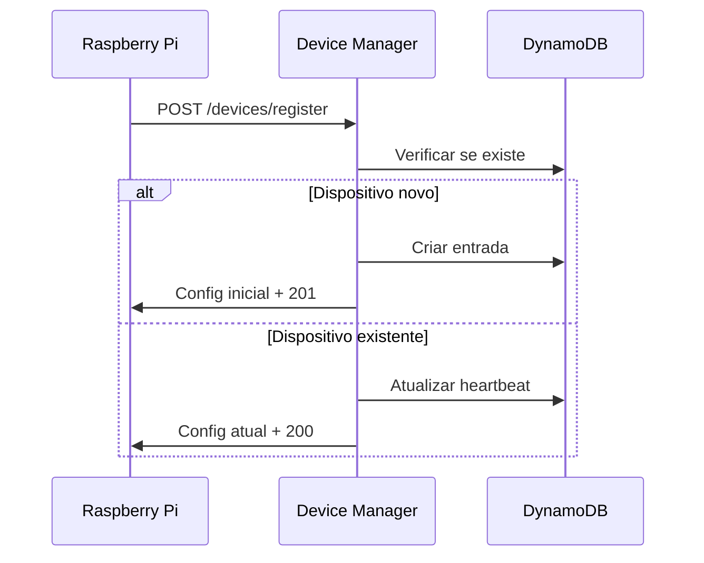
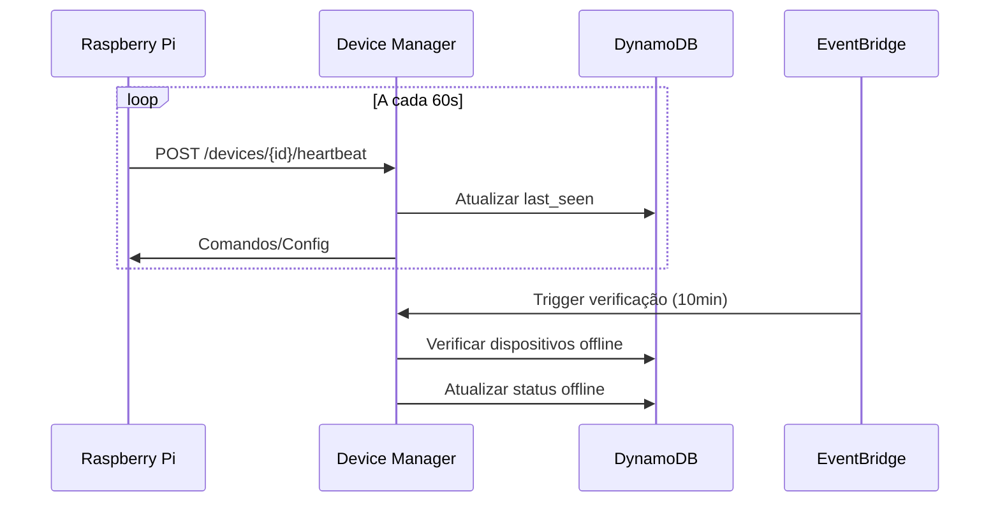
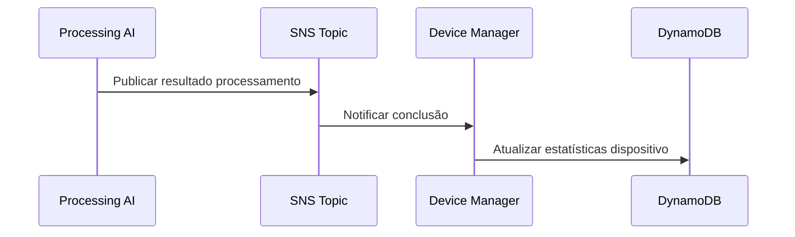

# Lambda Device Management

Lambda especializada no gerenciamento de dispositivos Raspberry Pi para o sistema de detecção e análise de maturação de frutas. Responsável pelo ciclo de vida completo dos dispositivos, incluindo registro, monitoramento de heartbeat, configuração e rastreamento de estatísticas.

## Funcionalidades

- Registro e cadastro de novos dispositivos Raspberry Pi
- Monitoramento de heartbeat em tempo real
- Gerenciamento de configurações por dispositivo
- Rastreamento de estatísticas de captura e processamento
- Detecção automática de dispositivos offline
- Atualização de estatísticas via notificações SNS
- Dashboard de status e métricas agregadas
- Configuração global para múltiplos dispositivos
- Monitoramento de saúde e alertas
- API RESTful para integração com frontend

## Estrutura

```
lambda-device-management/
├── src/
│   ├── app/
│   │   ├── __init__.py
│   │   ├── config.py           # Configurações da aplicação
│   │   ├── lambda_handler.py   # Handler principal do Lambda
│   │   └── main.py             # Aplicação FastAPI
│   ├── routes/
│   │   ├── __init__.py
│   │   ├── device_routes.py    # Endpoints de dispositivos
│   │   └── health_routes.py    # Endpoints de monitoramento
│   ├── services/
│   │   ├── __init__.py
│   │   └── device_service.py   # Lógica de negócio
│   ├── repository/
│   │   ├── __init__.py
│   │   └── dynamo_repository.py# Acesso ao DynamoDB
│   └── utils/
│       ├── __init__.py
│       └── validators.py       # Validações de entrada
├── requirements.txt
├── Dockerfile
└── README.MD
```

## Configuração

### Variáveis de Ambiente

**Ambiente e Logs**
- `ENVIRONMENT`: Ambiente (hom/prod)
- `LOG_LEVEL`: Nível de logging (INFO)
- `AWS_REGION`: Região AWS (us-east-1)

**Armazenamento**
- `DYNAMODB_TABLE_NAME`: Tabela DynamoDB principal
- `DYNAMODB_TTL_DAYS`: TTL para itens temporários (30 dias)

**Notificações**
- `SNS_PROCESSING_COMPLETE_TOPIC`: Tópico SNS para notificações

**Configurações de Dispositivo**
- `HEARTBEAT_TIMEOUT_MINUTES`: Timeout para considerar offline (5 min)
- `OFFLINE_CHECK_INTERVAL_MINUTES`: Intervalo de verificação (10 min)
- `DEFAULT_CAPTURE_INTERVAL`: Intervalo padrão de captura (300s)
- `DEFAULT_IMAGE_QUALITY`: Qualidade padrão da imagem (85)
- `DEFAULT_HEARTBEAT_INTERVAL`: Intervalo padrão de heartbeat (60s)

## Endpoints da API

### Registro e Heartbeat
- `POST /devices/register` - Registrar novo dispositivo
- `POST /devices/{device_id}/heartbeat` - Enviar heartbeat

### Gerenciamento
- `GET /devices/{device_id}` - Obter detalhes do dispositivo
- `GET /devices/all` - Listar todos os dispositivos
- `PUT /devices/{device_id}/config` - Atualizar configuração

### Estatísticas e Monitoramento
- `GET /devices/stats` - Estatísticas agregadas
- `POST /devices/global-config` - Configuração global
- `POST /devices/{device_id}/processing-notification` - Notificar processamento

### Saúde da Aplicação
- `GET /health` - Status básico
- `GET /health/detailed` - Status detalhado com dependências
- `GET /health/ready` - Verificação de prontidão
- `GET /health/live` - Verificação de vida
- `GET /health/devices-status` - Status dos dispositivos

## Modelos de Dados

### Registro de Dispositivo
```json
{
  "device_id": "rpi-dock-001",
  "device_name": "Raspberry Pi - Doca 1",
  "location": "dock-1",
  "capabilities": {
    "camera_resolution": "1280x720",
    "auto_capture": true,
    "local_storage": true,
    "processing_power": "low"
  },
  "status": "online"
}
```

### Resposta de Heartbeat
```json
{
  "device_id": "rpi-dock-001",
  "status": "online",
  "last_seen": "2025-01-01T12:00:00Z",
  "commands": [],
  "config_updates": {
    "capture_interval": 300,
    "image_quality": 85
  },
  "message": "Heartbeat processado com sucesso"
}
```

### Estrutura no DynamoDB
```json
{
  "pk": "DEVICE#rpi-dock-001",
  "sk": "INFO#rpi-dock-001",
  "entity_type": "DEVICE",
  "device_id": "rpi-dock-001",
  "device_name": "Raspberry Pi - Doca 1",
  "location": "dock-1",
  "status": "online",
  "createdAt": "2025-01-01T12:00:00Z",
  "updatedAt": "2025-01-01T12:05:00Z",
  "last_seen": "2025-01-01T12:05:00Z",
  "capabilities": {...},
  "config": {...},
  "stats": {...}
}
```

## Fluxo de Operação

### 1. Registro Inicial


### 2. Monitoramento Contínuo


### 3. Atualização de Estatísticas


## Deploy

### Desenvolvimento Local
```bash
# Instalar dependências
pip install -r requirements.txt

# Instalar shared-libs
cd ../shared-libs && pip install -e . && cd ../lambda-device-management

# Configurar variáveis
export ENVIRONMENT=dev
export DYNAMODB_TABLE_NAME=fruit-detection-dev-results
export AWS_REGION=us-east-1

# Executar localmente
python -m src.app.main
```

### Deploy com Docker
```bash
# Build da imagem
docker build -t device-management .

# Executar localmente
docker run -p 8000:8080 \
  -e ENVIRONMENT=dev \
  -e DYNAMODB_TABLE_NAME=fruit-detection-dev-results \
  device-management
```

### Deploy AWS Lambda
```bash
# Criar pacote de deployment
mkdir -p deployment/src
cp -r src/* deployment/src/
pip install -r requirements.txt -t deployment/

# Instalar shared-libs
cd ../shared-libs && pip install . -t ../lambda-device-management/deployment/
cd ../lambda-device-management

# Criar arquivo zip
cd deployment && zip -r ../lambda-device-management.zip . && cd ..

# Atualizar função Lambda
aws lambda update-function-code \
  --function-name fruit-detection-device-management-prod \
  --zip-file fileb://lambda-device-management.zip
```

## Configuração de Infraestrutura

### EventBridge Rule para Verificação Offline
```bash
# Criar regra para execução a cada 10 minutos
aws events put-rule \
  --name device-offline-check \
  --schedule-expression "rate(10 minutes)" \
  --description "Verificar dispositivos offline"

# Adicionar Lambda como target
aws events put-targets \
  --rule device-offline-check \
  --targets "Id"="1","Arn"="arn:aws:lambda:region:account:function:device-management"
```

### SNS Topic para Notificações
```bash
# Criar tópico
aws sns create-topic --name processing-complete-topic

# Inscrever Lambda no tópico
aws sns subscribe \
  --topic-arn arn:aws:sns:region:account:processing-complete-topic \
  --protocol lambda \
  --notification-endpoint arn:aws:lambda:region:account:function:device-management
```

## Monitoramento

### CloudWatch Logs
- **Log Group**: `/aws/lambda/fruit-detection-device-management-{env}`
- **Structured Logging**: JSON format para análise
- **Retenção**: 7 dias (configurável)

### Métricas Principais
- **Device Registration Rate**: Novos dispositivos por hora
- **Heartbeat Success Rate**: Porcentagem de heartbeats bem-sucedidos
- **Offline Detection Time**: Tempo para detectar dispositivos offline
- **Configuration Update Rate**: Atualizações de config por dispositivo
- **Statistics Update Rate**: Frequência de atualização de estatísticas

### Alarmes Configurados
- **High Error Rate**: > 5 erros em 5 minutos
- **Many Offline Devices**: > 50% dos dispositivos offline
- **Long Response Time**: > 5s para responder heartbeat
- **Failed Offline Checks**: Falhas na verificação agendada

### Dashboard Sugerido
- Gráfico de dispositivos online vs offline ao longo do tempo
- Mapa de calor de dispositivos por localização
- Estatísticas de captura por dispositivo
- Tempo de resposta médio de heartbeat
- Taxa de sucesso de processamento por dispositivo

## Integração com Outros Componentes

### Com Processing AI Lambda
- Recebe notificações SNS sobre conclusão de processamento
- Atualiza estatísticas do dispositivo correspondente
- Calcula métricas de performance (tempo médio, taxa de sucesso)

### Com Request Handler Lambda
- Fornece lista de dispositivos ativos para validação
- Pode ser consultada para verificar capacidades do dispositivo
- Valida se device_id nas requisições é válido

### Com Frontend/Dashboard
- API RESTful completa para gerenciamento
- Endpoints de estatísticas para dashboards

## Segurança

### Validação de Dados
- Validação rigorosa de device_id (alfanumérico + hífen/underscore)
- Sanitização de todos os campos de entrada
- Validação de tipos e ranges para configurações
- Rate limiting por dispositivo

### Logs de Auditoria
- Log de todas as operações de registro/atualização
- Rastreamento de alterações de configuração
- Correlação de eventos por device_id
- Detecção de padrões anômalos

## Limitações e Considerações

### Performance
- **Timeout Lambda**: 30 segundos para operações normais
- **Batch Size**: Máximo 1000 dispositivos por consulta
- **Rate Limit**: 100 heartbeats/minuto por dispositivo
- **Memory**: 1024MB para operações com muitos dispositivos

### Escalabilidade
- **DynamoDB**: Auto-scaling configurado
- **Concurrent Executions**: Até 100 execuções simultâneas
- **Heartbeat Frequency**: Mínimo 30s entre heartbeats

### Recuperação de Falhas
- **Retry Logic**: 3 tentativas com backoff exponencial
- **Dead Letter Queue**: Para eventos não processáveis
- **Circuit Breaker**: Para dependências indisponíveis
- **Graceful Degradation**: Funcionalidade essencial mantida

## Desenvolvimento

### Estrutura de Código
- **Clean Architecture**: Separação clara de responsabilidades
- **Repository Pattern**: Abstração de acesso aos dados
- **Service Layer**: Encapsulamento da lógica de negócio
- **Dependency Injection**: Facilita testes e manutenção

### Padrões de Código
- **Naming Convention**: snake_case para Python
- **Error Handling**: Exceções específicas e estruturadas
- **Logging**: Structured logging com contexto
- **Documentation**: Docstrings para todas as funções públicas

### Testes (Futuro)
```bash
# Estrutura de testes
tests/
├── unit/
│   ├── test_device_service.py
│   ├── test_validators.py
│   └── test_repository.py
├── integration/
│   ├── test_api_endpoints.py
│   └── test_dynamo_operations.py
└── fixtures/
    └── sample_devices.json

# Executar testes
pytest tests/ -v --cov=src
```

### CI/CD Pipeline
O pipeline está configurado em `.github/workflows/lambda-device.yml` com:
- **Linting**: Black + Ruff para formatação e qualidade
- **Testing**: Pytest com cobertura de código
- **Build**: Criação do pacote de deployment
- **Deploy**: Homologação (PR) e Produção (merge main)
- **Monitoring**: Health checks pós-deploy

## Troubleshooting

### Problemas Comuns

**Dispositivos não aparecem como online**
- Verificar se heartbeat está sendo enviado corretamente
- Confirmar se device_id está correto
- Checar logs do Lambda para erros de validação

**Configurações não são aplicadas**
- Verificar se dispositivo está online
- Confirmar formato da configuração (JSON válido)
- Checar se campos estão dentro dos ranges válidos

**Estatísticas não atualizam**
- Verificar se SNS topic está configurado corretamente
- Confirmar se Processing AI está enviando notificações
- Checar permissões do Lambda para receber SNS

**Performance degradada**
- Monitorar métricas de DynamoDB (throttling)
- Verificar timeout de Lambda
- Analisar logs para gargalos

### Logs Úteis
```bash
# Filtrar logs por device_id
aws logs filter-log-events \
  --log-group-name /aws/lambda/device-management \
  --filter-pattern "{ $.device_id = \"rpi-dock-001\" }"

# Buscar erros recentes
aws logs filter-log-events \
  --log-group-name /aws/lambda/device-management \
  --start-time $(date -d "1 hour ago" +%s)000 \
  --filter-pattern "ERROR"
```